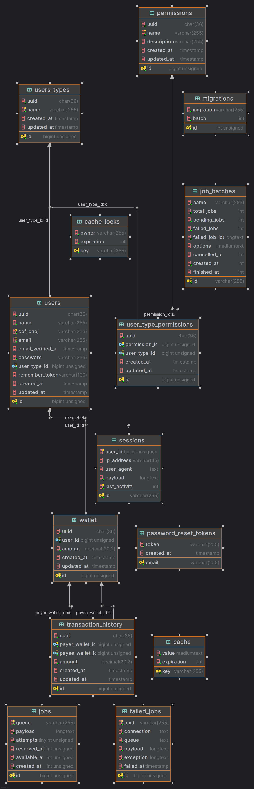

# DETALHAMENTO TÉCNICO

## Arquitetura do sistema

O sistema foi desenvolvido com base na arquitetura de monólito modular orientada a eventos, onde cada módulo possui responsabilidade bem definida e se comunica com os demais módulos quando necessário. Essa comunicação ocorre por meio de eventos e listeners, que podem ser síncronos ou assíncronos, conforme o contexto.

A API segue o padrão REST e possui dois endpoints principais: um para cadastro de usuários e outro para transferências. O endpoint de transferência utiliza o método POST e aceita um payload JSON conforme o contrato abaixo:

```json  
{  
    "value": 100.0, 
    "payer": "uuid-do-pagador", 
    "payee": "uuid-do-recebedor"
}  
```  

Para garantir segurança, o endpoint de transferência foi ajustado para receber os UUIDs dos usuários pagador (payer) e recebedor (payee).

Todos os endpoints são documentados utilizando OpenAPI, e a documentação estará disponível em:    
`http://localhost:6789/api/documentation#`
  
----

## Cache
Foi implementado um sistema de cache com Redis, aplicado especificamente no repositório `UserTypeRepository`, considerando a simplicidade da aplicação.
___  

## Testes e qualidade

Foram implementados 52 testes, entre unitários e de integração (features), totalizando 166 assertions, garantindo cobertura consistente e confiável das funcionalidades.

Para análise estática e padronização do código, foi utilizado o Laravel Pint, garantindo aderência às PSRs e boas práticas.

Para executar os testes, basta dentro do container da aplicação executar o comando

```php
php artisan test
```

## Banco de dados

O modelo de dados foi estruturado para refletir os tipos de usuário, suas carteiras e transações, garantindo integridade e performance.  



## Tratamento de erros
O tratamento de erros é centralizado no AppExceptionHandler, que captura e formata exceções específicas de regras de negócio, garantindo respostas HTTP apropriadas e claras para o cliente.

A versão implementada para o tratamento de erros é a versão reduzida apresentada nesse artigo autoral
[Guia Prático: Implementando Chain of Responsibility para Exceções Modulares em Laravel APIs](https://medium.com/@dvenanciom/guia-pr%C3%A1tico-implementando-chain-of-responsibility-para-exce%C3%A7%C3%B5es-modulares-em-laravel-apis-61208f8c6ff4)

## Desacoplamento e arquitetura limpa
Os componentes foram desacoplados via interfaces, facilitando manutenção, testes e evolução. Exemplos incluem serviços de cache (CacheService), HTTP (HttpService), logging (LoggerService) e transações (TransactionService).

## Ambiente e orquestração
A aplicação é containerizada utilizando Docker e Docker Compose para facilitar o ambiente de desenvolvimento e implantação, alinhando-se às melhores práticas modernas.  Além disso, a estrutura da orquestração foi detalhada no artigo autoral [Configurando um Ambiente Laravel com Docker: PHP 8.4, Node, NGINX, MySQL, Redis, Schedules e Jobs](https://medium.com/@dvenanciom/configurando-um-ambiente-laravel-com-docker-php-8-4-node-nginx-mysql-redis-schedules-e-jobs-18879888fa6b)
  
---  


## Executando a aplicação

### 🐳 Requisitos

-   Docker e Docker Compose  
    👉 Instale seguindo este tutorial, se precisar: [Instalando Docker e Docker Compose no Ubuntu 24.04](https://www.nerdlivre.com.br/instalando-docker-e-docker-compose-no-ubuntu-24-04/)


### 🚀 Subindo o projeto

1.  Clone o projeto e entre na pasta:


```bash
git clone https://github.com/venanciomagalhaes/api-transferencia-laravel.git
cd api-transferencia-laravel
```

2.  Copie os arquivos de ambiente:


```bash
cp .env.example .env
cp .env.example.testing .env.testing
```

3.  Construa e suba os containers Docker em modo destacado:


```bash
docker compose up -d --build
```

4. Para remover a aplicação, use
5. 
```bash
docker compose down -v
```

Pronto! Agora a aplicação está rodando em Docker e pronta para uso.

Link da documentação: http://localhost:6789/api/documentation#

Link da aplicação: http://localhost:6789

